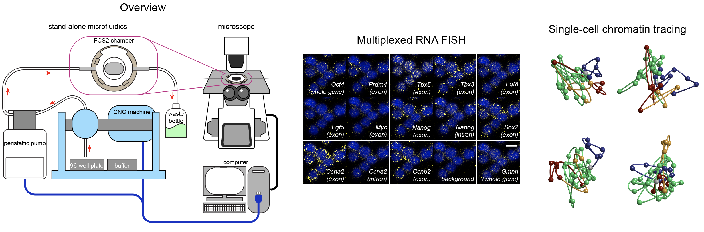

# SHACHI: Sequential Hybridization Automation for Conducting High-content Imaging

SHACHI is an open-source, stand-alone microfluidics system designed for sequential hybridization, enabling multiplexed RNA FISH and DNA FISH imaging on commercial microscopes without requiring complex modifications to existing setups. This system is cost-effective, easy to assemble, and operates via intuitive graphical user interface software.

## Overview and Example Data

The SHACHI system integrates seamlessly with commercial microscopes, providing high-quality multiplexed imaging for genomics and transcriptomics research.

## Features

- **Stand-alone Design**: Completely independent from the microscope, allowing compatibility with various commercial systems.
- **Multiplexed Imaging**: Supports up to 96 hybridization-imaging cycles.
- **Cost-Effective**: Build the system for approximately $8,000, significantly less expensive than custom-built or commercial alternatives.
- **Ease of Use**: Open-source software with an intuitive GUI for seamless operation.
- **Validated Performance**: Achieves high-quality multiplexed RNA FISH and DNA FISH imaging comparable to advanced platforms.

## Contact

Email: taihei.fuji_at_gmail.com
